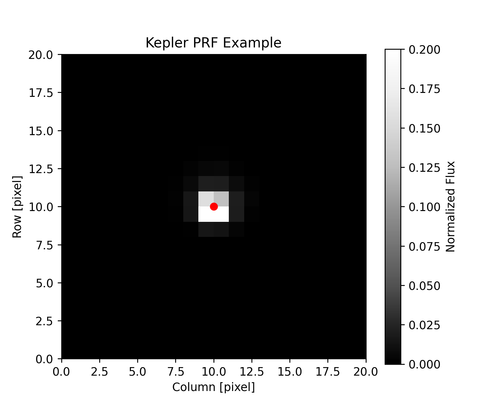
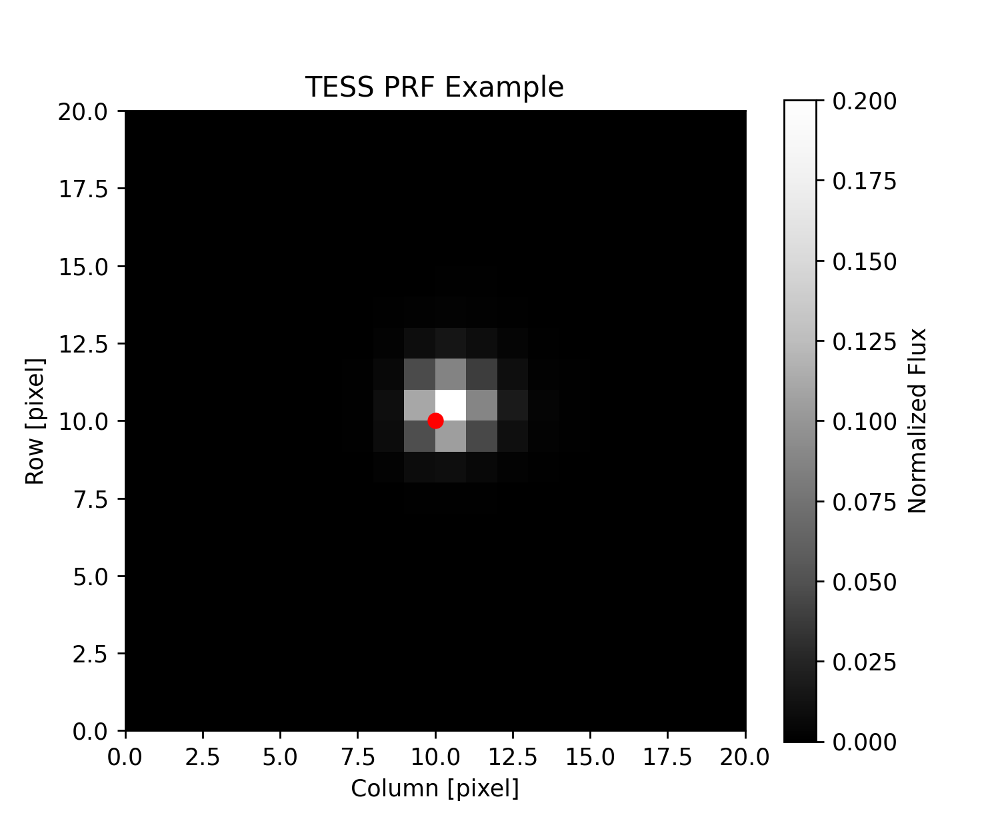

<a href="https://github.com/lightkurve/lkprf/actions/workflows/tests.yml"></a>
[](https://badge.fury.io/py/lkprf)

# `lkPRF`

`lkPRF` is a tool to work with PRF files from missions like NASA Kepler and [TESS](https://heasarc.gsfc.nasa.gov/docs/tess/). This tool enables you to load in PRF files from the engineering data, and evaluate them at given pixel positions.

## What is `lkPRF` doing?

This tool is doing two things for you:

1. Downloading and formating the engineering files for you.
2. Evaluating the PRF files on a pixel grid.

## Installation

You can install lkprf using pip:

```bash
pip install lkprf --upgrade
```

## Usage

> :question: **Note**: `lkprf` uses tuples to specify positions and uses the Python convention of `(row, column)`.

To use the package you first initialize a PRF model based on the mission you want to use

```python
import lkprf
prf = lkprf.KeplerPRF(channel=42)
```

or

```python
import lkprf
prf = lkprf.TESSPRF(camera=1, ccd=1)
```

You can then use either the `evaluate` or `gradient` functions to get the estimate of the PRF at a location, as shown below.

```python
prf.evaluate(targets=[(5, 5)], origin=(0, 0), shape=(11, 11))
```

This will return an array with shape  `(1, 11, 11)`, which contains an `(11, 11)` image containing one target at location `(row=5, column=5)`. The image origin is at `(row=0, column=0)`.

```python
prf.evaluate(targets=[(5, 5), (9, 9)], origin=(0, 0), shape=(11, 11))
```

This will return an array with shape  `(2, 11, 11)`, which contains two `(11, 11)` images. The first image contains one target at location `(row=5, column=5)`. The second image contains one target at location `(row=9, column=9)`. You can pass in a list of any number of target tuples to create PRFs for each target. PRFs are normalized such that, if all target flux falls in a pixel, the total flux will be one.

> :question: **Note**: If the "target" doesn't appear in your image, make sure the `origin` and `shape` keywords would create an array that contains your target coordinates.

Similarly you can get the gradient of the PRF

```python
prf.gradient(targets=[(5, 5)], origin=(0, 0), shape=(11, 11))
```

This will return a tuple containing two arrays, each with shape `(1, 11, 11)`. The first array is the gradient with respect to row, and the second is the gradient with respect to column. You can similarly pass in any number of targets to calculate the gradient for more targets.

## Examples

The below examples are created using the snippet

```python
prf.evaluate(targets=[(5, 5)], origin=(0, 0), shape=(11, 11))
```

### Kepler

Below is an example image for the Kepler PRF, for channel 42, with a source at position `(row=5, column=5)`.



### TESS

Below is an example image for the TES PRF, for Camera 1, CCD 1, with a source at position `(row=5, column=5)`.



## Problems with downloading PRF data

To use `lkPRF` you will have to be connected to the internet to download the relevant files. After you download the data for a given Camera/CCD/Channel these files will be stored within the package, so you will be able to use the data offline.

If you evaluate a PRF from a particular Camera/CCD/Channel once, you will notice a slow down as `lkPRF` downloads and builds the right files for you. If you interupt the download you may find that the file is corrupted. To ensure that the file is downloaded again, you will have to clear the cache. You can do this using

```python
import lkprf
lkprf.clear_kepler_cache()
lkprf.clear_tess_cache()
```

When `lkprf` can not find a PRF file on disk it will attempt to download it again.
